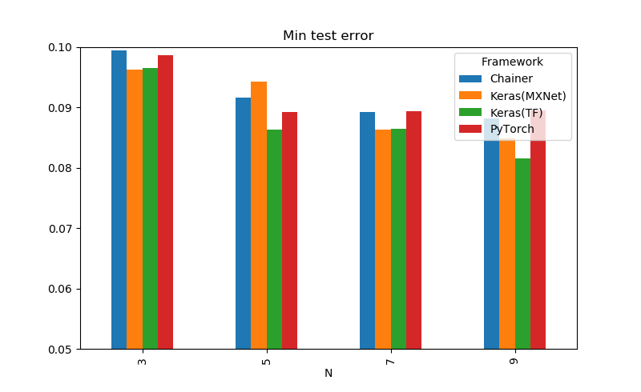
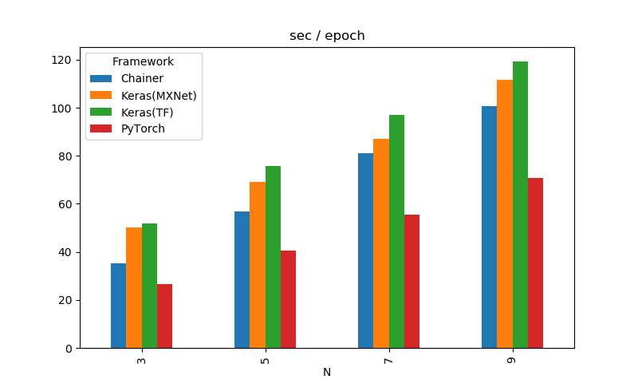

# ResNet-MultipleFramework
ResNet benchmark by Keras(TensorFlow), Keras(MXNet), Chainer, PyTorch using Google Colab

# Summary
| Framework    | N | # Layers | MinTestError | s / epoch |
|--------------|--:|---------:|-------------:|----------:|
| Keras(TF)    | 3 | 20       | 0.0965       | 51.817    |
| Keras(MXNet) | 3 | 20       | 0.0963       | 50.207    |
| Chainer      | 3 | 20       | 0.0995       | 35.360    |
| PyTorch      | 3 | 20       | 0.0986       | 26.602    |
| Keras(TF)    | 5 | 32       | 0.0863       | 75.746    |
| Keras(MXNet) | 5 | 32       | 0.0943       | 69.260    |
| Chainer      | 5 | 32       | 0.0916       | 56.854    |
| PyTorch      | 5 | 32       | 0.0893       | 40.670    |
| Keras(TF)    | 7 | 44       | 0.0864       | 96.946    |
| Keras(MXNet) | 7 | 44       | 0.0863       | 86.921    |
| Chainer      | 7 | 44       | 0.0892       | 80.935    |
| PyTorch      | 7 | 44       | 0.0894       | 55.465    |
| Keras(TF)    | 9 | 56       | 0.0816       | 119.361   |
| Keras(MXNet) | 9 | 56       | 0.0848       | 111.772   |
| Chainer      | 9 | 56       | 0.0882       | 100.730   |
| PyTorch      | 9 | 56       | 0.0895       | 70.834    |

* N denotes the number of shortcuts of each stage described in ResNet paper.
* For the number of layers, we used the formula 6N + 2 written in the paper. Since Conv2D stride 2 is used for subsampling instead of pooling, it is actually +2 this value.
* Time per epoch excluded the first epoch and took the average of the remaining 99 epochs.

# Settings
Parameters are based on the paper, but differences are

* Train on 100 epochs(The original iterates on 64k = 182 epochs).
* Not use verification datasets. Use 50k images for training.
* Initial learning rate is 0.01. Since it diverged when set to the original value 0.1. The learning rate scheduler remains to be used.
* Weight decay of regularization parameters was changed from 0.0001 to 0.0005 (as it tended to overfits overall).
* Run only once for each condition.

# Environment
| Library     | Version |
|-------------|:-------:|
| TensorFlow  | 1.10.1  |
| Keras       | 2.1.6   |
| mxnet-cu80  | 1.2.1   |
| Keras-mxnet | 2.2.2   |
| Chainer     | 4.4.0   |
| cupy-cuda80 | 4.4.0   |
| PyTorch     | 0.4.1   |
| Torchvision | 0.2.1   |

* Experiment on Google Colab(using GPU)
